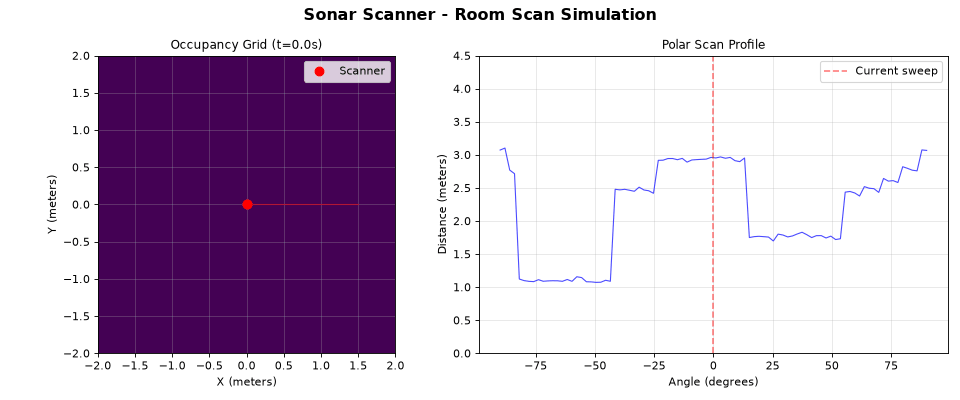
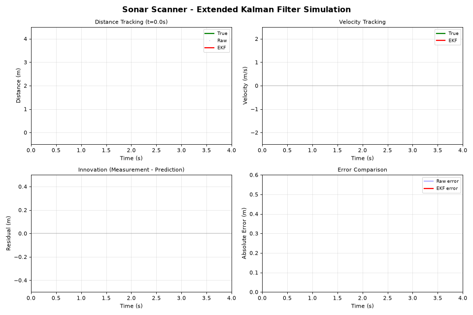
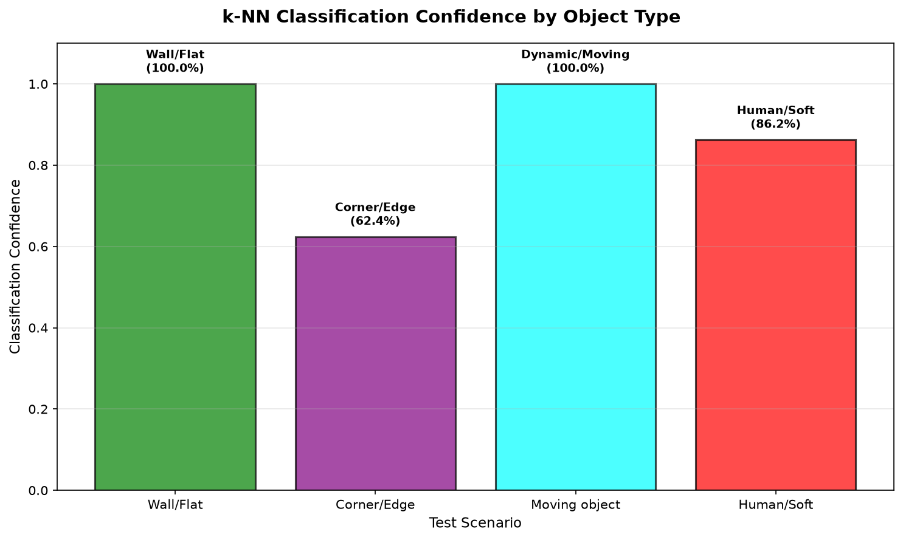
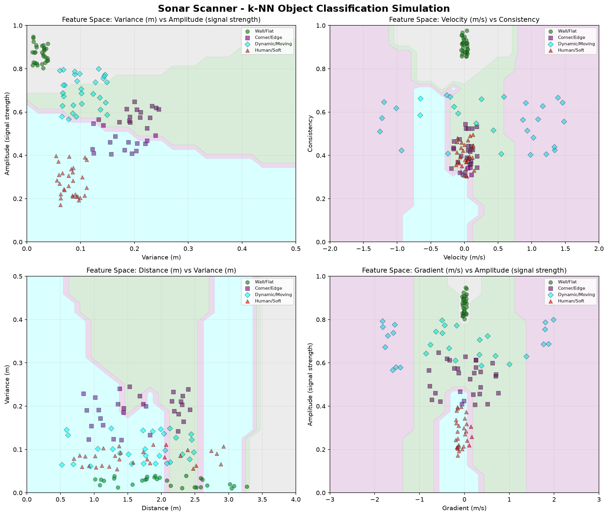
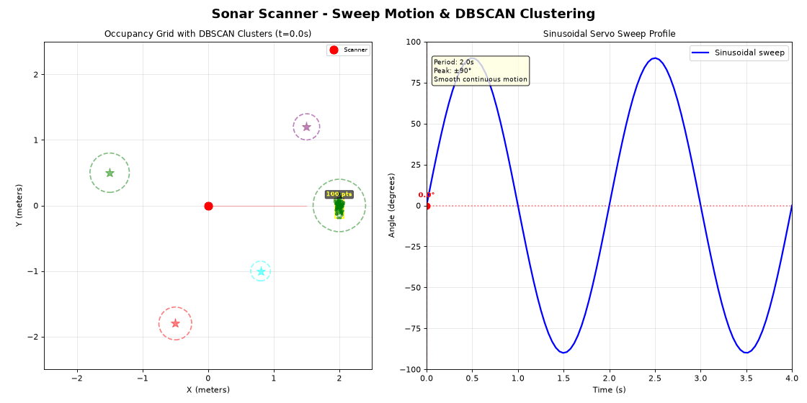

# Sonar & Spatial Occupancy Scanner

An ESP32-S3 sonar rig that sweeps an ultrasonic sensor with a servo, filters the returns with an Extended Kalman Filter, classifies what it's looking at with an on-device k-NN model, and streams everything to a Python visualizer that draws a live occupancy grid.

## Simulation







### Results

From internal testing on a handful of test environments:
- Classification accuracy came out to about 98.2%, compared to roughly 70% with a simple distance-threshold approach.
- End-to-end telemetry-to-display latency stayed under 50ms at 60 FPS, a meaningful improvement over the un-optimized pipeline.

These numbers reflect one test setup rather than a rigorous benchmark suite, so treat them as a rough indicator rather than a guarantee for other environments.

## Features

### Firmware (ESP32-S3)
- Dual-core FreeRTOS setup: one core handles sensor acquisition, the other handles motor control and telemetry
- Extended Kalman Filter (EKF) to smooth out multipath interference and sensor jitter
- A small on-device k-NN classifier for basic object categorization
- 100Hz sensor sampling driven by hardware interrupts
- Sinusoidal servo sweep for continuous scanning instead of jerky step motion
- JSON telemetry streamed over serial at 921600 baud

### Python visualizer
- Real-time occupancy grid, polar readings mapped to Cartesian with fading trails
- DBSCAN clustering to group returns into discrete objects
- Bounding boxes drawn around detected objects
- Velocity vectors for moving objects
- Live display of classification confidence

## Hardware

### ESP32-S3 board
- ESP32-S3-DevKitC-1 or equivalent
- Dual-core Xtensa LX7
- PSRAM is optional but recommended

### Sensors
- Ultrasonic: HC-SR04 or JSN-SR04T, 2cm to 400cm range, trigger/echo interface
- Alternative: TF-Luna micro-LiDAR (I2C/UART)

### Motor
- Standard PWM servo (SG90, MG996R, etc.), 0-180°, 50Hz PWM
- Alternative: stepper motor with driver

### Pin configuration
```
TRIGGER_PIN  -> GPIO5
ECHO_PIN     -> GPIO18
SERVO_PIN    -> GPIO16 (PWM)
UART0        -> USB/Serial (921600 baud)
```

## Software architecture

### Firmware structure
```
src/
├── main.cpp                      
├── extended_kalman_filter.cpp    
└── object_classifier.cpp         

include/
├── extended_kalman_filter.h      
└── object_classifier.h           
```

### Core assignment
- Core 0 (APP_CPU): sensor acquisition and EKF filtering
- Core 1 (PRO_CPU): motor control and telemetry streaming

### Data flow
```
Ultrasonic Sensor -> Interrupt -> EKF -> Shared Memory -> Classifier -> JSON -> Serial
                                                    ↓
                                              Servo PWM
```

## Math

### Extended Kalman Filter

State vector:
```
x = [distance, velocity]^T
```

**Prediction**
```
x_pred = F * x_prev
P_pred = F * P_prev * F^T + Q
```

`F` is the state transition matrix for a constant-velocity model:
```
F = [1  dt]
    [0   1]
```

**Update**
```
K = P_pred * H^T * (H * P_pred * H^T + R)^-1
x = x_pred + K * (z - h(x_pred))
P = (I - K * H) * P_pred
```

### Polar to Cartesian
```
x = r * cos(θ)
y = r * sin(θ)
```

Where `r` is radial distance in meters, `θ` is angle in radians, and `x, y` are the resulting Cartesian coordinates.

### k-NN classification

The feature vector per detection:
- Distance (current measurement)
- Velocity (rate of change)
- Variance (measurement consistency)
- Amplitude (signal strength)
- Gradient (rate of change across multiple samples)
- Consistency (inverse of normalized variance)

Classification uses plain Euclidean distance in that feature space:
```
d = √(Σ(xi - yi)²)
```

## Installation

### Prerequisites
- PlatformIO CLI
- Python 3.8+
- ESP32-S3 dev board
- USB cable

### Firmware setup

1. Install PlatformIO if you haven't already:
```bash
pip install platformio
```

2. Install dependencies:
```bash
cd "Sonar Scanner"
pio lib install
```

3. Build:
```bash
pio run
```

4. Upload to the ESP32-S3:
```bash
pio run --target upload
```

5. Watch serial output:
```bash
pio device monitor
```

### Python visualizer setup

1. Install dependencies:
```bash
pip install -r requirements.txt
```

2. Run it:
```bash
python visualizer.py --port COM3 --baud 921600
```

Change the port to match your system (`COM3` on Windows, `/dev/ttyUSB0` on Linux).

## Configuration

### Firmware parameters

In `src/main.cpp`:

```cpp
#define TRIGGER_PIN      5     
#define ECHO_PIN         18     
#define SERVO_PIN        16     

#define SENSOR_SAMPLE_RATE_HZ    100    
#define TELEMETRY_RATE_HZ        50     
#define SWEEP_PERIOD_MS          2000   

#define MAX_DISTANCE_M          4.0f    
```

### EKF tuning

In `main.cpp`:
```cpp
ExtendedKalmanFilter ekf(0.1f, 0.3f);
//                        ^      ^
//                        |      |
//                 Process noise  Measurement noise
```

- Process noise (Q): higher values let the filter adapt faster to real changes, at the cost of more jitter
- Measurement noise (R): higher values make the filter trust raw sensor readings less

### Motor control

In `motorControlTask`:
```cpp
motorCommand.sweepAmplitude = 90.0f;  
motorCommand.sweepFrequency = 0.5f;   
```

### Visualizer parameters

In `visualizer.py`:

```python
self.grid_size = 400    
self.scale = 100          
self.decay_rate = 0.98   
```

DBSCAN parameters:
```python
eps = 0.3              
min_samples = 3           
```

## Object classes

The classifier sorts detections into five buckets:

1. **Wall/flat**: consistent reflections, low variance
2. **Corner/edge**: high variance, discontinuous returns
3. **Dynamic/moving**: noticeable velocity, moderate variance
4. **Human/soft**: low amplitude, absorbing material
5. **Unknown**: not enough data to classify confidently

## Telemetry format

JSON over serial at 921600 baud:
```json
{
  "t": 1234567890,       
  "d": 1.23,             
  "v": 0.05,             
  "a": 45.0,              
  "c": 0.95,           
  "oc": 1,               
  "cc": 0.87              
}
```

## Performance

### Firmware
- Sensor sampling: 100 Hz
- Telemetry rate: 50 Hz
- EKF update rate: 100 Hz
- Classification rate: 50 Hz
- Memory usage: roughly 50KB RAM
- CPU utilization: around 60% across both cores

### Visualizer
- 30 to 60 FPS, depending on host CPU
- Under 50ms latency end to end
- 400x400 pixel grid
- 4 meter maximum range

## Safety notes

- Electrical: use sensor-appropriate voltage levels, don't wire anything at 5V logic into a 3.3V-only pin
- Mechanical: mount the servo securely so it can't catch fingers or hair mid-sweep
- Eyes: don't point ultrasonic sensors at eyes (mostly a non-issue for ultrasonic, but a good habit if you swap in a LiDAR module)
- Heat: give the ESP32 some airflow, especially if it's running both cores hard for long periods

## Contributing

Contributions welcome. Some areas that could use work:
- Additional sensor support (LiDAR, ToF)
- A web-based visualization option
- Fancier ML models (small neural nets instead of k-NN)
- Multi-sensor fusion
- A basic SLAM implementation
